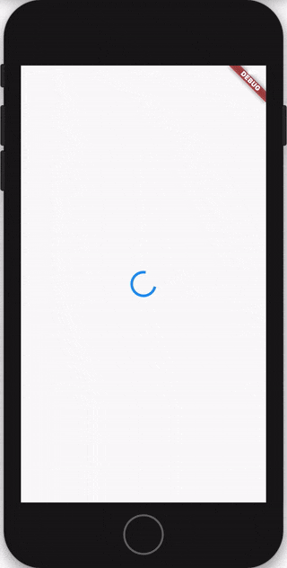

# Flutter 登陆教程


> 在这个教程中, 我们会使用Flutter和bloc库实现一个登陆的应用.



## 项目的建立

我们从建立一个全新的flutter项目开始.

```sh
flutter create flutter_login
```

用以下的代码替换`pubspec.yaml`中的内容

```sh
flutter packages get
```

## Authentication Repository

The first thing we're going to do is create an `authentication_repository` package which will be responsible for managing the authentication domain.

We'll start by create a `packages/authentication_repository` directory at the root of the project which will contain all internal packages.

At a high level, the directory structure should look like this:

```sh
├── android
├── ios
├── lib
├── packages
│   └── authentication_repository
└── test
```

然后安装所有的依赖.

[pubspec.yaml](https://raw.githubusercontent.com/felangel/bloc/master/examples/flutter_login/packages/authentication_repository/pubspec.yaml ':include')

## User Repository (用户数据仓库)

我们将会创建`UserRepository`来帮助我们管理用户的数据.

```dart
class UserRepository {
  Future<String> authenticate({
    @required String username,
    @required String password,
  }) async {
    await Future.delayed(Duration(seconds: 1));
    return 'token';
  }

  Future<void> deleteToken() async {
    /// delete from keystore/keychain
    await Future.delayed(Duration(seconds: 1));
    return;
  }

  Future<void> persistToken(String token) async {
    /// write to keystore/keychain
    await Future.delayed(Duration(seconds: 1));
    return;
  }

  Future<bool> hasToken() async {
    /// read from keystore/keychain
    await Future.delayed(Duration(seconds: 1));
    return false;
  }
}
```

?> **附注**: 简单起见, 我们的`UserRepository`只是在进行功能的模拟. 但在真正项目的实现中, 你可能希望依赖注入[HttpClient](https://pub.dev/packages/http)一些类似于[Flutter Secure Storage (Flutter 安全存储)](https://pub.dev/packages/flutter_secure_storage)的对象来读写真正的keystore(秘钥存储器)/keychain(钥匙串).

## 验证 States(状态)

下一步, 我们需要决定要怎么管理应用的不同状态, 并创建所需的 blocs (business logic components, 业务逻辑组件)

总体来说, 我们需要管理用户的验证状态. 用户验证状态可以是以下的几种之一:

- uninitialized (未初始化) - 在应用启动的时候等待用户是否验证通过的状态
- loading (加载中) - 等待维护/删除token的状态
- authenticated - successfully authenticated
- authenticated (已验证) - 成功验证状态
- unauthenticated (未验证) - 没验证通过的状态

对每种状态都会有与之对应的呈现给用户的内容.

比如:
<!-- - if the authentication state was uninitialized, the user might be seeing a splash screen. -->
- 如果验证状态是未初始化, 应该让用户看到splash屏幕
- 如果验证状态是加载中, 应该让用户看到进度条屏幕
- 如果验证状态是已验证, 应该让用户看到主屏幕.
- 如果验证状态是未验证, 应该让用户看到登陆表单.

> 在开始实现之前就构想出要用到哪些不同的states, 这一点很非常重要.

分析完都有哪些验证状态之后, 我们终于可以实现`AuthenticationState`类了.

Next, we'll create the `pubspec.yaml` for the `user_repository`:

[pubspec.yaml](https://raw.githubusercontent.com/felangel/bloc/master/examples/flutter_login/packages/user_repository/pubspec.yaml ':include')

The `user_repository` will be responsible for the user domain and will expose APIs to interact with the current user.

The first thing we will define is the user model in `lib/src/models/user.dart`:

[user.dart](https://raw.githubusercontent.com/felangel/bloc/master/examples/flutter_login/packages/user_repository/lib/src/models/user.dart ':include')

For simplicity, a user just has an `id` property but in practice we might have additional properties like `firstName`, `lastName`, `avatarUrl`, etc...

?> **附注**: 我们使用[`equatable(相等)`](https://pub.dev/packages/equatable)包赋予`AuthenticationState`对象能互相比较相等的能力. 默认状态下, `==`仅当被比较对象是同一对象的时候才返回true.

## 验证 Events(事件)

定义好了`AuthenticationState`之后, 下一步我们需要定义`AuthenticationEvents`. 我们的`AuthenticationBloc`会根据这些events(事件)做出反应

我们会需要:

- `AppStarted` 事件来通知bloc, 告诉bloc需要检查当前用户是否已经通过了验证.
- `LoggedIn` 事件来通知bloc, 告诉bloc这个用户已经成功的登入了.
- `LoggedOut` 事件来通知bloc, 告诉bloc这个用户已经成功的登出了.

For this simple example, the `UserRepository` exposes a single method `getUser` which will retrieve the current user. We are stubbing this but in practice this is where we would query the current user from the backend.

Almost done with the `user_repository` package -- the only thing left to do is create the `user_repository.dart` file in `lib` which define the public exports:

[user_repository.dart](https://raw.githubusercontent.com/felangel/bloc/master/examples/flutter_login/packages/user_repository/lib/user_repository.dart ':include')

Now that we have the `authentication_repository` and `user_repository` packages complete, we can focus on the Flutter application.

## Installing Dependencies

Let's start by updating the generated `pubspec.yaml` at the root of our project:

[pubspec.yaml](https://raw.githubusercontent.com/felangel/bloc/master/examples/flutter_login/pubspec.yaml ':include')

We can install the dependencies by running:

```sh
flutter packages get
```

?> **附注**: `meta`包被用于标注实例化`AuthenticationEvent`时必须传入的参数. 如果dart语法分析器发现开发者没有传入必须的参数, 它就会发出警告.

## 验证 Bloc

我们已经定义好了`AuthenticationState`和`AuthenticationEvents`. 下一步我们会开始实现`AuthenticationBloc`. 它会负责在发生新的`AuthenticationEvents`时检查和更新用户的`AuthenticationState`

我们从创建`AuthenticationBloc`类开始.

The implementation for the `AuthenticationBloc` is inside of `lib/authentication` because we treat authentication as a feature in our application layer.

```sh
├── lib
│   ├── app.dart
│   ├── authentication
│   │   ├── authentication.dart
│   │   └── bloc
│   │       ├── authentication_bloc.dart
│   │       ├── authentication_event.dart
│   │       └── authentication_state.dart
│   ├── main.dart
```

?> **附注**: 只是从类的定义就可以知道: 这个bloc会把`AuthenticationEvents`转换成`AuthenticationStates`.

?> **附注**: 我们的`AuthenticationBloc`依赖了`UserRepository`

我们可以从重写`initialState`方法开始. 让它返回 `AuthenticationUninitialized()`状态.

In this application, the `AuthenticationBloc` will be reacting to two different events:

现在我们只剩下实现`mapEventToState`方法了.

```dart
@override
Stream<AuthenticationState> mapEventToState(
  AuthenticationEvent event,
) async* {
  if (event is AppStarted) {
    final bool hasToken = await userRepository.hasToken();

    if (hasToken) {
      yield AuthenticationAuthenticated();
    } else {
      yield AuthenticationUnauthenticated();
    }
  }

  if (event is LoggedIn) {
    yield AuthenticationLoading();
    await userRepository.persistToken(event.token);
    yield AuthenticationAuthenticated();
  }

  if (event is LoggedOut) {
    yield AuthenticationLoading();
    await userRepository.deleteToken();
    yield AuthenticationUnauthenticated();
  }
}
```

好的! 我们最终的`AuthenticationBloc`应该会是这样

```dart
import 'dart:async';

import 'package:meta/meta.dart';
import 'package:bloc/bloc.dart';
import 'package:user_repository/user_repository.dart';

import 'package:flutter_login/authentication/authentication.dart';

class AuthenticationBloc
    extends Bloc<AuthenticationEvent, AuthenticationState> {
  final UserRepository userRepository;

  AuthenticationBloc({@required this.userRepository})
      : assert(userRepository != null);

  @override
  AuthenticationState get initialState => AuthenticationUninitialized();

  @override
  Stream<AuthenticationState> mapEventToState(
    AuthenticationEvent event,
  ) async* {
    if (event is AppStarted) {
      final bool hasToken = await userRepository.hasToken();

      if (hasToken) {
        yield AuthenticationAuthenticated();
      } else {
        yield AuthenticationUnauthenticated();
      }
    }

    if (event is LoggedIn) {
      yield AuthenticationLoading();
      await userRepository.persistToken(event.token);
      yield AuthenticationAuthenticated();
    }

    if (event is LoggedOut) {
      yield AuthenticationLoading();
      await userRepository.deleteToken();
      yield AuthenticationUnauthenticated();
    }
  }
}
```

现在我们的`AuthenticationBloc`已经全都实现好了, 让我们开始表现层的工作吧.

## Splash Page (启动页面)

首先我们需要一个`SplashPage` widget. 在`AuthenticationBloc`确定用户是否登录之前, 这个widget将会作为Splash Screen(启动屏幕)呈现给用户.

The `AuthenticationState` class has three named constructors:

- `AuthenticationState.unknown()`: the default state which indicates that the bloc does not yet know whether the current user is authenticated or not.

## Home Screen (主页)

下一步, 我们需要创建`HomePage`. 用户成功登入后会被引导到这个页面.

```dart
import 'package:flutter/material.dart';

import 'package:flutter_bloc/flutter_bloc.dart';

import 'package:flutter_login/authentication/authentication.dart';

class HomePage extends StatelessWidget {
  @override
  Widget build(BuildContext context) {
    return Scaffold(
      appBar: AppBar(
        title: Text('Home'),
      ),
      body: Container(
        child: Center(
            child: RaisedButton(
          child: Text('logout'),
          onPressed: () {
            BlocProvider.of<AuthenticationBloc>(context).add(LoggedOut());
          },
        )),
      ),
    );
  }
}
```

?> **附注**: 这是第一个用到了`flutter_bloc`的类. 我们会马上讲到`BlocProvider.of<AuthenticationBloc>(context)`的含义, 现在你只需要知道通过这行程序我们就能访问到`AuthenticationBloc`.

?>  **附注**: 当用户点击 logout 按钮时, 我们会添加一个`LoggedOut`事件到`AuthenticationBloc`

再下一步, 我们需要创建`LoginPage`和`LoginForm`

`LoginForm`需要处理用户的输入(点击login按钮), 同时它也包含一些业务逻辑(为每次登陆获取一个token), 因此我们需要另外创建一个`LoginBloc`.

就像我们已经实现的`AuthenticationBloc`一样, 我们需要定义`LoginState`和`LoginEvents`. 让我们从`LoginState`开始吧

## Login States (登陆状态)

[main.dart](https://raw.githubusercontent.com/felangel/bloc/master/examples/flutter_login/lib/main.dart ':include')

?> **Note**: We are injecting a single instance of the `AuthenticationRepository` and `UserRepository` into the `App` widget (which we will get to next).

## App

`app.dart` will contain the root `App` widget for the entire application.

[app.dart](https://raw.githubusercontent.com/felangel/bloc/master/examples/flutter_login/lib/app.dart ':include')

?> **Note**: `app.dart` is split into two parts `App` and `AppView`. `App` is responsible for creating/providing the `AuthenticationBloc` which will be consumed by the `AppView`. This decoupling will enable us to easily test both the `App` and `AppView` widgets later on.

?> **Note**: `RepositoryProvider` is used to provide the single instance of `AuthenticationRepository` to the entire application which will come in handy later on.

`AppView` is a `StatefulWidget` because it maintains a `GlobalKey` which is used to access the `NavigatorState`. By default, `AppView` will render the `SplashPage` (which we will see later) and it uses `BlocListener` to navigate to different pages based on changes in the `AuthenticationState`.

## Splash

> The splash feature will just contain a simple view which will be rendered right when the app is launched while the app determines whether the user is authenticated.

```sh
lib
└── splash
    ├── splash.dart
    └── view
        └── splash_page.dart
```

`LoginInitial` 是登陆表单的初始状态.

`LoginLoading` 是校验登录时登陆表单的状态.

`LoginFailure` 是登录失败时登陆表单的状态.

现在我们已经定义好了`LoginState`, 接下来让我们看看`LoginEvent`类吧

## Login Events (登录事件)

For simplicity, we are just validating the username to ensure that it is not empty but in practice you can enforce special character usage, length, etc...

#### Password

[password.dart](https://raw.githubusercontent.com/felangel/bloc/master/examples/flutter_login/lib/login/models/password.dart ':include')

Again, we are just performing a simple check to ensure the password is not empty.

#### Models Barrel

Just like before, there is a `models.dart` barrel to make it easy to import the `Username` and `Password` models with a single import.

当用户点击登录按钮时, `LoginButtonPressed`事件会被添加给`LoginBloc`. 它会通知`LoginBloc`, 告诉它它需要为给定的账户请求一个token.

我们现在可以实现`LoginBloc`了

> The `LoginBloc` manages the state of the `LoginForm` and takes care validating the username and password input as well as the state of the form.

#### login_event.dart

In this application there are three different `LoginEvent` types:

- `LoginUsernameChanged`: notifies the bloc that the username has been modified.
- `LoginPasswordChanged`: notifies the bloc that the password has been modified.
- `LoginSubmitted`: notifies the bloc that the form has been submitted.

[login_event.dart](https://raw.githubusercontent.com/felangel/bloc/master/examples/flutter_login/lib/login/bloc/login_event.dart ':include')

#### login_state.dart

The `LoginState` will contain the status of the form as well as the username and password input states.

[login_state.dart](https://raw.githubusercontent.com/felangel/bloc/master/examples/flutter_login/lib/login/bloc/login_state.dart ':include')

?> **Note**: The `Username` and `Password` models are used as part of the `LoginState` and the status is also part of [package:formz](https://pub.dev/packages/formz).

#### login_bloc.dart

?> **附注**: `LoginBloc`依赖了`UserRepository`, 因为我们需要通过`UserRepository`校验给定的用户名和密码的合法性.

?> **附注**: `LoginBloc`依赖了`AuthenticationBloc`, 因为在用户输入正确的信息时我们需要通过`AuthenticationBloc`更新`AuthenticationState`.

这样我们就写好了`LoginBloc`. 接下来, 我们可以开始`LoginPage`和`LoginForm`的工作了.

## Login Page (登陆页面)

`LoginPage` widget 是一个容器widget, 它会为它的子树注入`LoginBloc`和`AuthenticationBloc`的依赖

Next let's take a look at the `LoginPage` and `LoginForm`.

### Login Page

> The `LoginPage` is responsible for exposing the `Route` as well as creating and providing the `LoginBloc` to the `LoginForm`.

[login_page.dart](https://raw.githubusercontent.com/felangel/bloc/master/examples/flutter_login/lib/login/view/login_page.dart ':include')

?> **Note**: `context.repository` is used to lookup the instance of `AuthenticationRepository` via the `BuildContext`.

### Login Form

?> **附注**: `LoginPage`是一个`StatelessWidget (无状态 widget)`. `LoginPage`将会使用`BlocProvider`来 创建、关闭 `LoginBloc`, 并让`LoginBloc`能被子树中的widget访问到.

?> **附注**: 我们使用依赖注入到这里的`UserRepository`来创建`LoginBloc`

?> **附注**: 我们又一次用到了`BlocProvider.of<AuthenticationBloc>(context)`来从`LoginPage`访问`AuthenticationBloc`.

下一步让我们继续向前进行, 创建`LoginForm`吧.

## Login Form (登陆表单)

```dart
import 'package:flutter/material.dart';
import 'package:flutter_bloc/flutter_bloc.dart';
import 'package:flutter_login/login/login.dart';

class LoginForm extends StatefulWidget {
  @override
  State<LoginForm> createState() => _LoginFormState();
}

class _LoginFormState extends State<LoginForm> {
  final _usernameController = TextEditingController();
  final _passwordController = TextEditingController();

  @override
  Widget build(BuildContext context) {
    _onLoginButtonPressed() {
      BlocProvider.of<LoginBloc>(context).add(
        LoginButtonPressed(
          username: _usernameController.text,
          password: _passwordController.text,
        ),
      );
    }

    return BlocListener<LoginBloc, LoginState>(
      listener: (context, state) {
        if (state is LoginFailure) {
          Scaffold.of(context).showSnackBar(
            SnackBar(
              content: Text('${state.error}'),
              backgroundColor: Colors.red,
            ),
          );
        }
      },
      child: BlocBuilder<LoginBloc, LoginState>(
        builder: (context, state) {
          return Form(
            child: Column(
              children: [
                TextFormField(
                  decoration: InputDecoration(labelText: 'username'),
                  controller: _usernameController,
                ),
                TextFormField(
                  decoration: InputDecoration(labelText: 'password'),
                  controller: _passwordController,
                  obscureText: true,
                ),
                RaisedButton(
                  onPressed:
                      state is! LoginLoading ? _onLoginButtonPressed : null,
                  child: Text('Login'),
                ),
                Container(
                  child: state is LoginLoading
                      ? CircularProgressIndicator()
                      : null,
                ),
              ],
            ),
          );
        },
      ),
    );
  }
}
```

?> **附注**: `LoginForm`使用了 `BlocBuilder` widget. `BlocBuilder`会负责在`LoginState`更新时重新构建他下属的widget. 实例化一个`BlocBuilder`需要提供一个 `bloc`和一个`builder函数`作为参数. `BlocBuilder`会相应新产生的state, 用他们构建新的widget. `BlocBuilder`很像`StreamBuilder`, 但它的API更简单, 减少了很多重复的代码的同时也比`StreamBuilder`多进行了很多性能的优化.

这样`LoginForm`就没什么其他要做的事情了, 所以我们继续创建 loading indicator (加载指示器) widget 吧.

## Loading Indicator (加载指示器)

## Home

> Upon a successful `logIn` request, the state of the `AuthenticationBloc` will change to `authenticated` and the user will be navigated to the `HomePage` where we display the user's `id` as well as a button to log out.

现在终于是时候把一切整合起来了, 我们会在`main.dart`创建应用的主widget.

## 把一切整合起来

```dart
import 'package:flutter/material.dart';

import 'package:bloc/bloc.dart';
import 'package:flutter_bloc/flutter_bloc.dart';
import 'package:user_repository/user_repository.dart';

import 'package:flutter_login/authentication/authentication.dart';
import 'package:flutter_login/splash/splash.dart';
import 'package:flutter_login/login/login.dart';
import 'package:flutter_login/home/home.dart';
import 'package:flutter_login/common/common.dart';

class SimpleBlocDelegate extends BlocDelegate {
  @override
  void onEvent(Bloc bloc, Object event) {
    print(event);
    super.onEvent(bloc, event);
  }

  @override
  void onTransition(Bloc bloc, Transition transition) {
    print(transition);
    super.onTransition(bloc, transition);
  }

  @override
  void onError(Bloc bloc, Object error, StackTrace stackTrace) {
    print(error);
    super.onError(bloc, error, stackTrace);
  }
}

void main() {
  BlocSupervisor.delegate = SimpleBlocDelegate();
  final userRepository = UserRepository();
  runApp(
    BlocProvider<AuthenticationBloc>(
      create: (context) {
        return AuthenticationBloc(userRepository: userRepository)
          ..add(AppStarted());
      },
      child: App(userRepository: userRepository),
    ),
  );
}

class App extends StatelessWidget {
  final UserRepository userRepository;

  App({Key key, @required this.userRepository}) : super(key: key);

  @override
  Widget build(BuildContext context) {
    return MaterialApp(
      home: BlocBuilder<AuthenticationBloc, AuthenticationState>(
        builder: (context, state) {
          if (state is AuthenticationUninitialized) {
            return SplashPage();
          }
          if (state is AuthenticationAuthenticated) {
            return HomePage();
          }
          if (state is AuthenticationUnauthenticated) {
            return LoginPage(userRepository: userRepository);
          }
          if (state is AuthenticationLoading) {
            return LoadingIndicator();
          }
        },
      ),
    );
  }
}
```

?> **附注**: 又一次, 我们使用了`BlocBuilder`来相应`AuthenticationState`的改变. 我们会根据当前的`AuthenticationState`来决定我们会给用户展示`SplashPage`, `LoginPage`, `HomePage`, `LoadingIndicator`中的哪个.

?> **附注**: 你会发现整个应用被包裹在一个`BlocProvider`里面, 因为这样就可以使`AuthenticationBloc`能够被整个widget子树访问到了. `BlocProvider`是一个 flutter widget, 它会通过`BlocProvider.of(context)`向它的子widget提供bloc(这也就是依赖注入). 它被用作为一个依赖注入(DI) widget, 这样可以保证同一个bloc被提供给子树中的多个widget.

这样我们在`HomePage`和`LoginPage`里面写的`BlocProvider.of<AuthenticationBloc>(context)`就可以用了.

因为我们的 `App` widget 被包裹在了`BlocProvider<AuthenticationBloc>`里面, 我们可以在子树中的任何地方用`BlocProvider.of<AuthenticationBloc>(BuildContext context)`静态方法来访问同一个`AuthenticationBloc`的实例.

到此为止, 我们已经很好的实现了登陆功能, 用bloc库达到了表现层和业务逻辑层的解耦.

你可以在[这里](https://github.com/felangel/Bloc/tree/master/examples/flutter_login)找到这个例子的完整的代码.
